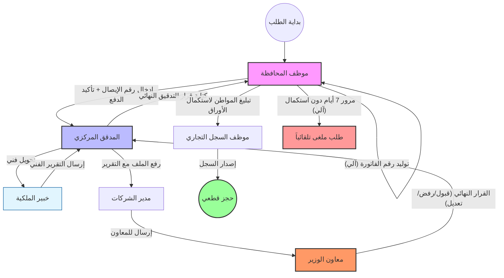

# توثيق مسار عمل "بوابة التجارة" (الإصدار الثاني - المحدث)

هذا الإصدار يعتمد **المدقق المركزي** كمحرك أساسي ومنسق لكل العمليات، مع تعميم نظام الفوترة على كافة المحافظات.

## 📊 مخطط سير العمل المحدث (Mermaid Diagram)

## 📝 شرح المسار المعدل (حالات القبول والرفض)

### 1️⃣ مرحلة التقديم والرسوم (لكافة المحافظات)
*   **الجديد:** لم يعد نظام الرسوم حكراً على ريف دمشق، بل أصبح قاعدة عامة.
*   **توليد الفاتورة:** الموظف يضغط "تقديم"، النظام يولد رقم دفع.
*   **تأكيد الموظف:** يمنع النظام وصول الطلب للمدقق المركزي إلا بعد أن يضغط موظف المحافظة على زر **"تم الدفع"** مع إرفاق رقم إيصال الدفع.

### 2️⃣ المدقق المركزي (المنسق):
*   يستلم الطلب المدفوع.
*   **في حال الرفض المبدئي (نقص أوراق):** يعيده مباشرة لموظف المحافظة.
*   **في حال الحاجة لخبرة فنية:** يحيله لـ **خبير الملكية**.
*   **استلام التقرير:** الخبير لا يرسل للمدير، بل يعيد التقرير للمدقق المركزي ليقوم الأخير بجمع الأوراق ورفعها للإدارة.

### 3️⃣ سلسلة القيادة والعودة للمدقق:
*   يمر الطلب (مدقق -> مدير الشركات -> معاون الوزير).
*   **العودة:** قرار معاون الوزير لا يذهب للمواطن أو الموظف مباشرة، بل يعود للمدقق المركزي ليقوم بـ "صياغته" بشكل نهائي وإرساله للمحافظة.

### 4️⃣ قاعدة الـ 7 أيام (قاعدة هامة):
*   بمجرد وصول القرار (مقبول) لموظف المحافظة، يبدأ **عداد تنازلي لـ 7 أيام**.
*   إذا لم يقم المواطن بجلب أوراقه وتعديل حالته لدى **موظف السجل**، يُعتبر الطلب ملغى ويتحرر الاسم تلقائياً.

### 5️⃣ حالات القبول والرفض:
*   **الرفض القطعي:** ينهي المعاملة ويحرر الاسم فوراً.
*   **طلب التعديل:** يعود الطلب للمدقق، ومنه للموظف، ليقوم الموظف بتعديل (الاسم مثلاً) وإعادة الإرسال دون دفع رسوم جديدة (لأنها نفس المعاملة).

---
> [!IMPORTANT]
> **ملاحظة فنية:** سنحتاج لإضافة حقل "رقم الإيصال اليدوي" في واجهة الموظف لتوثيق أن الدفع تم فعلاً قبل نقل الطلب للمدقق.
